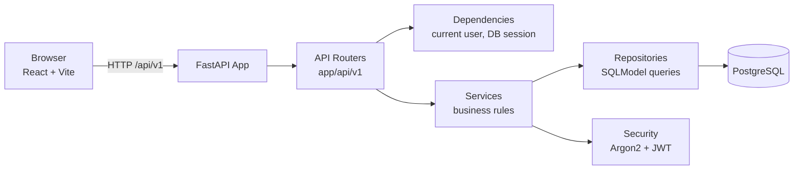
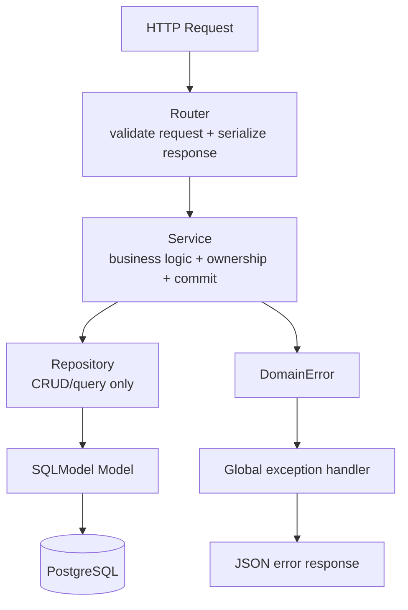
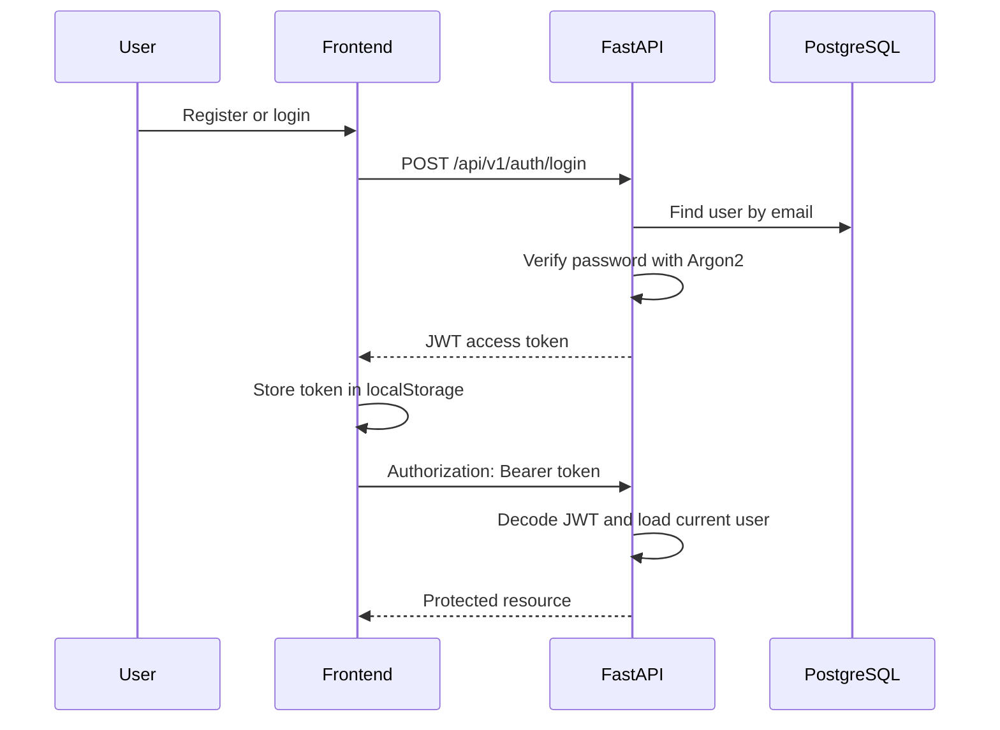
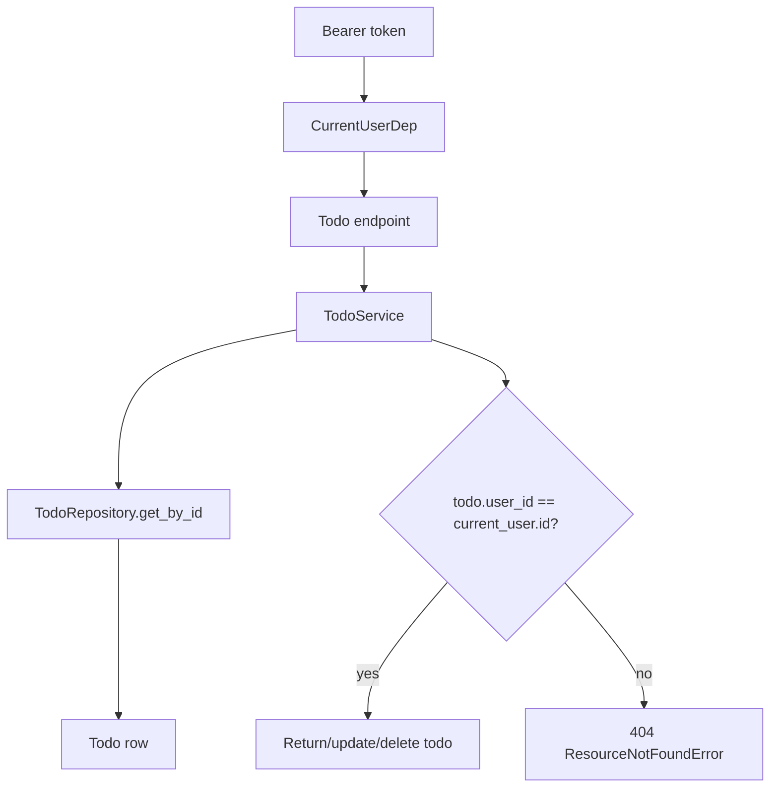
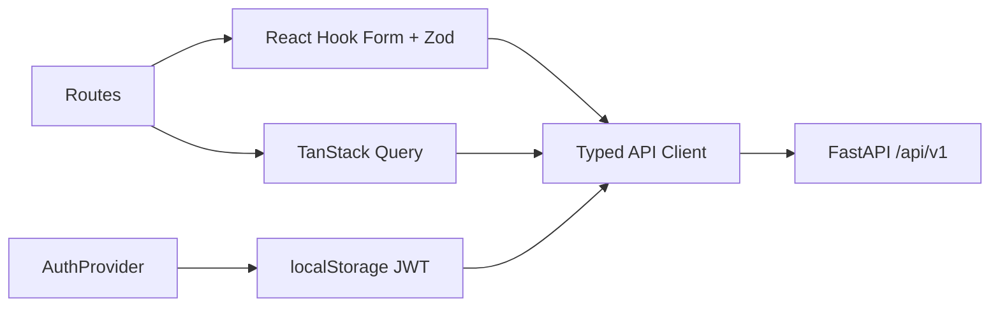

# FastAPI Todolist

Full-stack todo list application with a FastAPI backend, PostgreSQL database, JWT authentication, and a React TypeScript frontend.

## Tech Stack

Backend:

- FastAPI
- SQLModel
- PostgreSQL
- Alembic
- Pydantic Settings
- JWT with `python-jose`
- Argon2 password hashing via `passlib[argon2]`
- uv for Python dependency management

Frontend:

- React
- TypeScript
- Vite
- Tailwind CSS
- React Router
- TanStack Query
- React Hook Form
- Zod
- Lucide React
- Geist Sans and Geist Mono

## Project Structure

```text
.
├── app/
│   ├── api/v1/              # FastAPI route handlers
│   ├── core/                # config, database, deps, security, exceptions
│   ├── models/              # SQLModel table models
│   ├── repositories/        # database access layer
│   ├── schemas/             # request/response DTOs
│   ├── services/            # business logic and transaction boundaries
│   └── main.py              # FastAPI application entrypoint
├── alembic/                 # database migrations
├── frontend/                # React TypeScript frontend
│   ├── src/components/      # reusable UI components
│   ├── src/lib/             # API client, auth, types, helpers
│   ├── src/routes/          # route-level screens
│   └── tailwind.config.ts   # design tokens from DESIGN.md
├── DESIGN.md                # frontend design system
├── AGENTS.md                # frontend architecture rules
├── docker-compose.yml
├── Dockerfile
├── pyproject.toml
└── README.md
```

## Architecture

### System Diagram



### Backend Layering



### Auth Flow



### Todo Ownership Flow



## Prerequisites

- Python 3.12+
- uv
- Node.js 24+ and npm
- Docker and Docker Compose
- PostgreSQL, or the provided Docker Compose PostgreSQL service

Check local versions:

```bash
python --version
uv --version
node --version
npm --version
docker --version
```

## Environment Variables

Create `.env` from the example:

```bash
cp .env.example .env
```

Example:

```env
APP_NAME=fastapi-todolist
APP_ENV=development
DEBUG=true

POSTGRES_USER=todolist
POSTGRES_PASSWORD=todolist
POSTGRES_DB=todolist
POSTGRES_HOST=localhost
POSTGRES_PORT=5436

JWT_SECRET_KEY=change-me-use-openssl-rand-hex-32
JWT_ALGORITHM=HS256
JWT_ACCESS_TOKEN_EXPIRE_MINUTES=60
```

Generate a stronger JWT secret for local use:

```bash
openssl rand -hex 32
```

## Backend Setup

### 1. Install Python Dependencies

```bash
uv sync
```

### 2. Start PostgreSQL

```bash
docker compose up -d postgres
```

PostgreSQL is exposed on host port `5436`.

### 3. Run Migrations

```bash
uv run alembic upgrade head
```

### 4. Start FastAPI

<!-- đã đổi port 8001 cho frontend -->

```bash
uv run uvicorn app.main:app --reload --host 127.0.0.1 --port 8001
```

Backend URLs:

- API root: `http://127.0.0.1:8000`
- Health check: `http://127.0.0.1:8000/health`
- Swagger docs: `http://127.0.0.1:8000/docs`
- ReDoc: `http://127.0.0.1:8000/redoc`

### Docker App Note

`docker-compose.yml` can build and run the FastAPI app container:

```bash
docker compose up --build
```

The current runtime image copies `app/` only. Run Alembic migrations from the host with `uv run alembic upgrade head` before relying on the app container.

## Frontend Setup

Open another terminal:

```bash
cd frontend
npm install
npm run dev
```

Frontend URL:

```text
http://127.0.0.1:5173/
```

The Vite dev server proxies `/api` to:

```text
http://localhost:8000
```

So the backend should be running on port `8000`.

Build frontend for production:

```bash
cd frontend
npm run build
```

Lint frontend:

```bash
cd frontend
npm run lint
```

## Common Commands

Backend:

```bash
uv sync
docker compose up -d postgres
uv run alembic upgrade head
uv run uvicorn app.main:app --reload --host 127.0.0.1 --port 8000
uv run ruff check app tests
uv run mypy app
uv run pytest -q
```

Frontend:

```bash
cd frontend
npm install
npm run dev
npm run lint
npm run build
```

Docker:

```bash
docker compose up -d postgres
docker compose up --build
docker compose down
docker compose down -v
```

## API Documentation

Base URL:

```text
http://127.0.0.1:8000/api/v1
```

Protected endpoints require:

```http
Authorization: Bearer <access_token>
```

### Error Format

Domain errors return:

```json
{
  "error": {
    "code": "RESOURCE_NOT_FOUND",
    "message": "Todo with id 1 not found"
  }
}
```

FastAPI validation errors use the default `detail` format.

## Auth API

### Register

```http
POST /api/v1/auth/register
```

Request:

```json
{
  "email": "user@example.com",
  "password": "password123"
}
```

Response `201 Created`:

```json
{
  "id": 1,
  "email": "user@example.com",
  "is_active": true,
  "created_at": "2026-05-04T01:00:00Z"
}
```

Rules:

- `email`: valid email, max 255 chars, normalized to lowercase
- `password`: 8-128 chars
- duplicate email returns `409 RESOURCE_CONFLICT`

Example:

```bash
curl -X POST http://127.0.0.1:8000/api/v1/auth/register \
  -H "Content-Type: application/json" \
  -d '{"email":"user@example.com","password":"password123"}'
```

### Login

```http
POST /api/v1/auth/login
```

Request:

```json
{
  "email": "user@example.com",
  "password": "password123"
}
```

Response `200 OK`:

```json
{
  "access_token": "<jwt>",
  "token_type": "bearer"
}
```

Example:

```bash
curl -X POST http://127.0.0.1:8000/api/v1/auth/login \
  -H "Content-Type: application/json" \
  -d '{"email":"user@example.com","password":"password123"}'
```

### Get Current User

```http
GET /api/v1/auth/me
```

Response `200 OK`:

```json
{
  "id": 1,
  "email": "user@example.com",
  "is_active": true,
  "created_at": "2026-05-04T01:00:00Z"
}
```

Example:

```bash
curl http://127.0.0.1:8000/api/v1/auth/me \
  -H "Authorization: Bearer <access_token>"
```

## Todo API

All todo endpoints are scoped to the authenticated user. A user cannot read, update, or delete another user's todo.

### Todo Response Shape

```json
{
  "id": 1,
  "title": "Write README",
  "description": "Add setup guide and API docs",
  "is_completed": false,
  "created_at": "2026-05-04T01:00:00Z",
  "updated_at": "2026-05-04T01:00:00Z"
}
```

### Create Todo

```http
POST /api/v1/todos
```

Request:

```json
{
  "title": "Write README",
  "description": "Add setup guide and API docs"
}
```

Response `201 Created`: `TodoResponse`

Rules:

- `title`: required, 1-255 chars
- `description`: optional, max 2000 chars
- new todos are created with `is_completed=false`

Example:

```bash
curl -X POST http://127.0.0.1:8000/api/v1/todos \
  -H "Authorization: Bearer <access_token>" \
  -H "Content-Type: application/json" \
  -d '{"title":"Write README","description":"Add setup guide and API docs"}'
```

### List Todos

```http
GET /api/v1/todos
```

Query params:

| Param          | Type    | Default | Description                 |
| -------------- | ------- | ------- | --------------------------- |
| `is_completed` | boolean | `null`  | Filter by completion status |
| `skip`         | integer | `0`     | Offset, must be `>= 0`      |
| `limit`        | integer | `20`    | Max items, `1-100`          |

Response `200 OK`:

```json
[
  {
    "id": 1,
    "title": "Write README",
    "description": "Add setup guide and API docs",
    "is_completed": false,
    "created_at": "2026-05-04T01:00:00Z",
    "updated_at": "2026-05-04T01:00:00Z"
  }
]
```

Examples:

```bash
curl "http://127.0.0.1:8000/api/v1/todos?skip=0&limit=20" \
  -H "Authorization: Bearer <access_token>"

curl "http://127.0.0.1:8000/api/v1/todos?is_completed=true" \
  -H "Authorization: Bearer <access_token>"
```

### Get Todo

```http
GET /api/v1/todos/{todo_id}
```

Response `200 OK`: `TodoResponse`

Example:

```bash
curl http://127.0.0.1:8000/api/v1/todos/1 \
  -H "Authorization: Bearer <access_token>"
```

### Update Todo

```http
PATCH /api/v1/todos/{todo_id}
```

Request fields are optional:

```json
{
  "title": "Write complete README",
  "description": "Include setup, API, and architecture",
  "is_completed": true
}
```

Response `200 OK`: `TodoResponse`

Example:

```bash
curl -X PATCH http://127.0.0.1:8000/api/v1/todos/1 \
  -H "Authorization: Bearer <access_token>" \
  -H "Content-Type: application/json" \
  -d '{"is_completed":true}'
```

### Delete Todo

```http
DELETE /api/v1/todos/{todo_id}
```

Response:

```text
204 No Content
```

Example:

```bash
curl -X DELETE http://127.0.0.1:8000/api/v1/todos/1 \
  -H "Authorization: Bearer <access_token>"
```

## Frontend Architecture

The frontend follows `AGENTS.md` and `DESIGN.md`.

Important files:

- `frontend/src/lib/api.ts`: typed API client
- `frontend/src/lib/auth.tsx`: auth provider and session state
- `frontend/src/lib/useAuth.ts`: auth hook
- `frontend/src/lib/types.ts`: API TypeScript models
- `frontend/src/routes/AuthPage.tsx`: login/register
- `frontend/src/routes/TodoApp.tsx`: protected todo workspace
- `frontend/src/components/`: reusable UI primitives
- `frontend/tailwind.config.ts`: Geist/Vercel-inspired design tokens

Frontend data flow:



## Design System

The UI follows `DESIGN.md`:

- white canvas
- primary text `#171717`
- Geist Sans and Geist Mono
- shadow-as-border instead of regular card borders
- small radii: 6px controls, 8px cards
- workflow accent colors only when meaningful
- no decorative gradients or heavy shadows

## Database Notes

Main tables:

- `user`
  - `id`
  - `email`
  - `hashed_password`
  - `is_active`
  - `created_at`
  - `updated_at`
- `todo`
  - `id`
  - `title`
  - `description`
  - `is_completed`
  - `user_id`
  - `created_at`
  - `updated_at`

Todo rows reference `user.id`. The service layer checks ownership before read/update/delete.

## Development Checklist

Before opening a PR or considering the app ready:

```bash
uv run ruff check app tests
uv run mypy app
uv run pytest -q

cd frontend
npm run lint
npm run build
```

Current test folder exists, but backend test coverage still needs to be added.

## Troubleshooting

### Frontend cannot call backend

Make sure FastAPI is running:

```bash
curl http://127.0.0.1:8000/health
```

If using Vite dev server, requests to `/api` are proxied to `http://localhost:8000`.

### Database connection fails

Check that PostgreSQL is healthy:

```bash
docker compose ps
```

Confirm `.env` uses:

```env
POSTGRES_HOST=localhost
POSTGRES_PORT=5436
```

when running FastAPI on the host machine.

### Tables do not exist

Run migrations:

```bash
uv run alembic upgrade head
```

### Invalid or expired token

Login again and use the fresh token:

```http
Authorization: Bearer <access_token>
```
